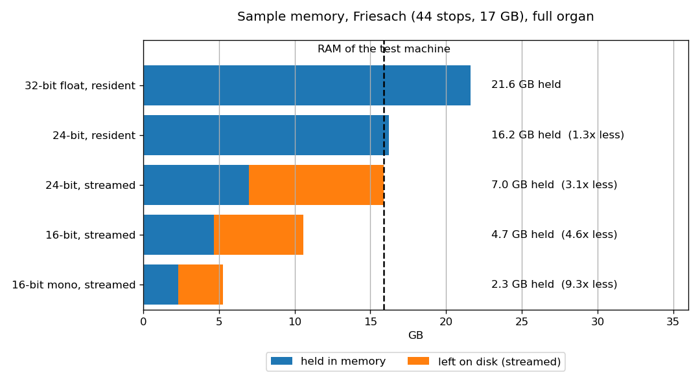
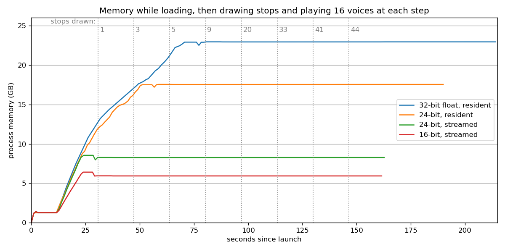
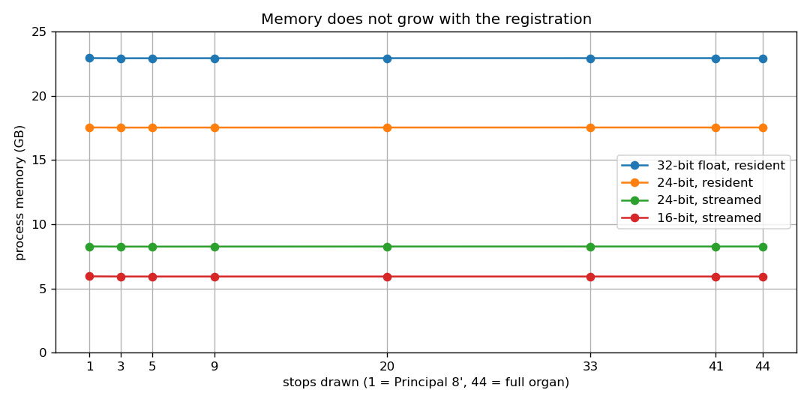
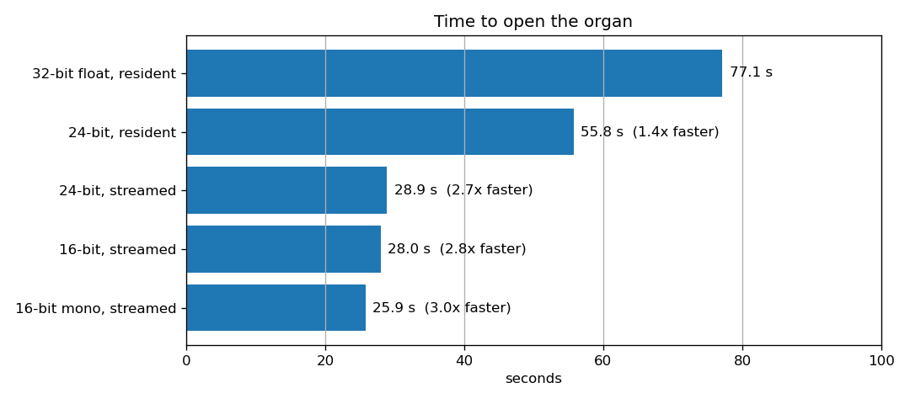
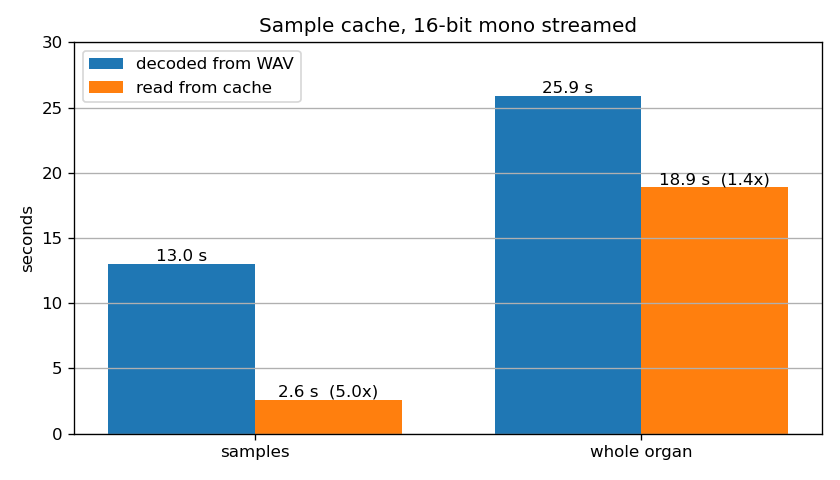
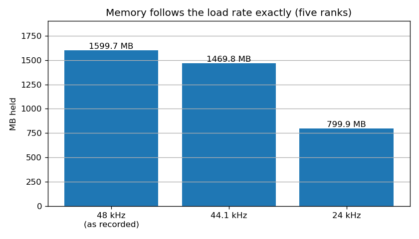

# Performance

How much memory a sampled organ needs, how long it takes to open, and what each
of Masterpiece's engine settings gains. Every figure is measured on a real
sample set; the method is at the end so the results can be repeated.

## Summary

| | Baseline | Masterpiece | Gain |
|---|---:|---:|---:|
| Sample memory, full organ | 21.6 GB | 2.3 GB | **9.3x less** |
| Sample memory, stereo kept | 21.6 GB | 4.7 GB | **4.6x less** |
| Sample memory, bit-exact 24-bit | 21.6 GB | 16.2 GB | **1.3x less** |
| Time to open the organ | 77.1 s | 25.9 s | **3.0x faster** |
| Sample loading, from the cache | 13.0 s | 2.6 s | **5.0x faster** |
| Memory added by drawing all 44 stops | | none | **flat** |

The baseline is the conventional approach: every sample decoded to 32-bit
floating point and held in memory.

## Test bed

| | |
|---|---|
| Instrument | Friesach: 44 stops, three manuals and pedal |
| Sample set | 17.0 GB, 12,148 WAV files, 24-bit / 48 kHz / stereo |
| Machine | 15.9 GB RAM, Windows |
| Build | Masterpiece 0.3.3, Release |

## Techniques

| Technique | What it does |
|---|---|
| **Release streaming** | A release tail is several seconds of room sound, played once from its start and never looped. Masterpiece keeps only its first frames in memory and streams the rest from disk into a per-voice ring buffer while it sounds. Attacks and sustain loops stay in memory. |
| **24-bit storage** | The source files are 24-bit. Samples are held as 24-bit integers instead of being widened to 32-bit float, so the audio in memory is bit-for-bit identical to the file. |
| **16-bit storage** | Samples are requantised to 16 bits against each file's own peak, so a quiet stop still uses every bit. |
| **Mono folding** | A stereo sample set is folded to mono as it loads. |
| **Sample cache** | The decoded, converted samples are written to one file, so the next load of the same organ with the same settings is one sequential read instead of 12,148 decodes. |
| **Load-time rate conversion** | Samples are converted to the audio device's rate as they load, so playback needs no per-voice rate conversion. |

## Memory



| Configuration | Held in memory | Left on disk | Memory saved | Reduction |
|---|---:|---:|---:|---:|
| 32-bit float, resident (baseline) | 21,606.5 MB | | | |
| 24-bit, resident | 16,204.9 MB | | 5,401.6 MB | 1.3x |
| 24-bit, streamed | 6,976.0 MB | 8,891.9 MB | 14,630.5 MB | 3.1x |
| 16-bit, streamed | 4,650.7 MB | 5,927.9 MB | 16,955.8 MB | 4.6x |
| 16-bit mono, streamed | 2,325.3 MB | 2,964.0 MB | 19,281.2 MB | 9.3x |

Release streaming is the largest single saving: it leaves **56% of the sample
data** on disk. The settings multiply, and each step is an exact ratio of the
one before:

| Step | Before | After | Ratio |
|---|---:|---:|---:|
| 32-bit float to 24-bit | 21,606.5 MB | 16,204.9 MB | 0.750 |
| 24-bit to 16-bit (streamed) | 6,976.0 MB | 4,650.7 MB | 0.667 |
| Stereo to mono | 4,650.7 MB | 2,325.3 MB | 0.500 |

The exact ratios confirm that the accounting measures the sample data itself.

### Memory while loading and playing



Each run opens the organ, then walks the registration from a single Principal
8′ to full organ in eight steps. At each step it plays the same 15-second
passage: notes build up to sixteen held voices, then all are released
together, so every voice is in its release tail at once.

Memory rises only while the organ loads. After that it stays level through
every registration step and every chord, including sixteen simultaneous
release tails streaming from disk.

### Memory against registration



Every rank is loaded whether its stop is drawn or not, so full organ costs the
same memory as a single stop. Peak process memory at each step:

| Configuration | 1 stop | 44 stops | Change |
|---|---:|---:|---:|
| 24-bit, streamed | 8,270 MB | 8,268 MB | −2 MB |
| 16-bit, streamed | 5,939 MB | 5,927 MB | −12 MB |

Drawing a stop never waits for samples to load, and a registration change
never allocates.

## Load time



| Configuration | Time to open | Speed-up |
|---|---:|---:|
| 32-bit float, resident (baseline) | 77.1 s | |
| 24-bit, resident | 55.8 s | 1.4x |
| 24-bit, streamed | 28.9 s | 2.7x |
| 16-bit, streamed | 28.0 s | 2.8x |
| 16-bit mono, streamed | 25.9 s | 3.0x |

Holding less also opens faster: a streaming load never reads the release tails,
which are more than half the data on disk.

## Sample cache



| 16-bit mono, streamed | Decoded from WAV | Read from cache | Speed-up |
|---|---:|---:|---:|
| Sample loading | 13.0 s | 2.6 s | **5.0x** |
| Whole organ | 25.9 s | 18.9 s | **1.4x** |

The cache file is 2,439 MB and stands in for about 7 GB of source files.

The cache is keyed to a fingerprint of everything that changes the bytes in
memory: the organ definition's size and modification time, storage width,
mono folding, load rate, preload head, loop selection, release streaming and
the ranks requested. Any change is a cache miss that rebuilds, never a stale
read. This was verified on a five-rank load: a 16-bit cache is reused at
16-bit, and rebuilt at 24-bit and at 16-bit mono to exactly the expected sizes
(291.8, 437.7 and 146.0 MB).

By default Masterpiece keeps a single cache file and replaces it when the organ
or settings change, so it never fills a disk. One cache per organ, or no cache,
can be chosen in the settings.

## Sample-rate conversion



Memory falls in exact proportion to the load rate: a 96 kHz sample set played
through a 48 kHz device takes half the memory. Verified on Friesach (five
ranks) by converting from its native 48 kHz:

| Load rate | Held in memory |
|---|---:|
| 48 kHz, as recorded | 1,599.7 MB |
| 44.1 kHz | 1,469.8 MB |
| 24 kHz | 799.9 MB |

Pitch and level are unchanged at every rate. A converted attack joined to a
converted streamed release tail matches a fully resident render to 0.0 dB
across the whole release.

## Audio fidelity

Measured on the sample data directly, applying exactly what the loader applies,
to 60 files chosen at random from the 12,148:

| Storage | Compared with the source file |
|---|---|
| 24-bit | Bit-for-bit identical |
| 16-bit | 78.1 dB signal to quantisation noise (median), 75.2 dB lowest |

## Method

- **Held / left on disk.** The sample library's own accounting, logged at the
  end of each load: `residentBytes()` sums the sample buffers actually held,
  `streamedBytesSaved()` sums what streaming left on disk.
- **Process memory.** The process's private bytes, sampled from outside it
  every 250 ms.
- **Load time.** From the start of the load to the organ being ready to play,
  as logged by the application.

## Reproducing

```
python build\memstudy-midi.py                 # the playing passage
powershell -File build\memstudy-all.ps1       # the configuration matrix
python build\memstudy-collect.py              # combine samples with the logs
python build\quantnoise.py                    # audio fidelity
powershell -File build\checkcache.ps1         # decoded against cached load
python build\make-perf-charts.py              # the charts in this report
```

Friesach is a freely published sample set by Piotr Grabowski and is not part of
this repository. See [ATTRIBUTION.md](ATTRIBUTION.md).
