<p align="center">
  
</p>

### A cross-platform, high-performance pipe organ sample player compatible with Hauptwerk sample sets.

https://github.com/user-attachments/assets/f9e38610-aaf4-4b95-8d1c-e8f7f04b7d77

<!-- hero: the demonstration clip goes on the next line, as a github.com/user-attachments URL -->
**[Watch the demonstration](https://bonninr.github.io/masterpiece/#hear)** — thirty-three works on nine organs, recorded from the application's own output · [programme and credits](ATTRIBUTION.md#music)

[](https://github.com/bonninr/masterpiece/releases/latest/download/masterpiece-windows.zip)
[](https://github.com/bonninr/masterpiece/releases/latest/download/masterpiece-macos-arm64.zip)
[](https://github.com/bonninr/masterpiece/releases/latest/download/masterpiece-macos-x86_64.zip)
[](https://github.com/bonninr/masterpiece/releases/latest/download/masterpiece-linux-x86_64.tar.gz)
[](https://github.com/bonninr/masterpiece/releases/latest/download/masterpiece-linux-arm64.tar.gz)
[](https://github.com/bonninr/masterpiece/releases/latest/download/masterpiece-linux-armhf.tar.gz)

[](https://github.com/bonninr/masterpiece/actions/workflows/build.yml)
[](https://github.com/bonninr/masterpiece/releases)
[](https://en.cppreference.com/w/cpp/20)
[](https://juce.com/)
[](https://cmake.org/)
[](#building)
[](#building)
[](LICENCE)

---

## What it is

Sampled pipe organs are distributed as large libraries: a recording of every
pipe, plus an XML definition describing the instrument around them — how the
console is drawn, which key reaches which pipe, what the couplers do, how the
wind system is built. Masterpiece reads those libraries and turns them back
into a playable instrument.

Written from scratch, it runs as a standalone application and as a VST3 or
LV2 plugin — the same engine either way. On macOS it is also built as an
Audio Unit, for both Apple
silicon and Intel; those builds ship unsigned, so the first time you
open the application, right-click it and choose Open.

---

## The console

The same program, reading different libraries.

| | |
|:--:|:--:|
| **Lipiny** — a historic case, drawstops lettered in Fraktur | **Melcer Chamber Music Hall** |
| 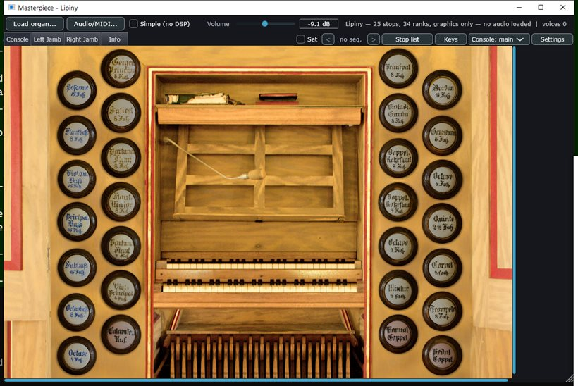 | 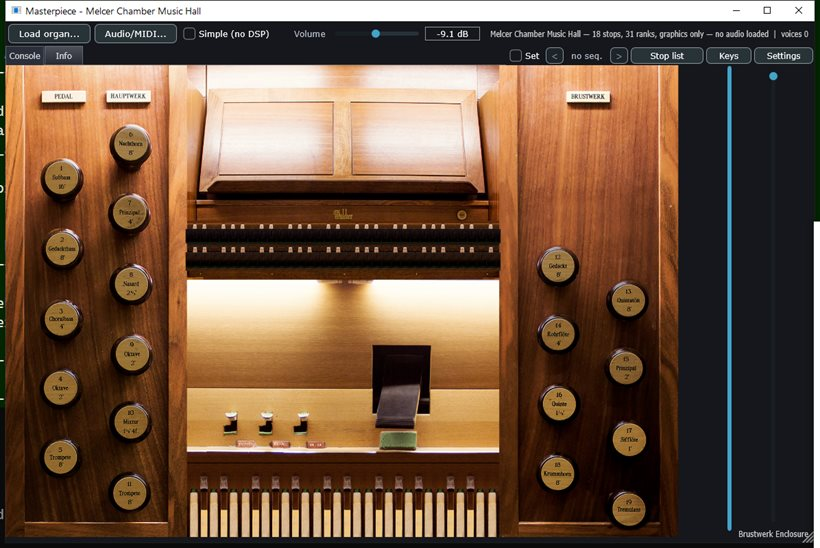 |
| A. Volkmann, 1898 · 25 stops · [sample set by Piotr Grabowski](https://piotrgrabowski.pl/lipiny/) | chamber organ · [sample set by Piotr Grabowski](https://piotrgrabowski.pl/melcer-chamber-music-hall/) |
| **Azzio** | **Kraków, St. John Cantius** |
| 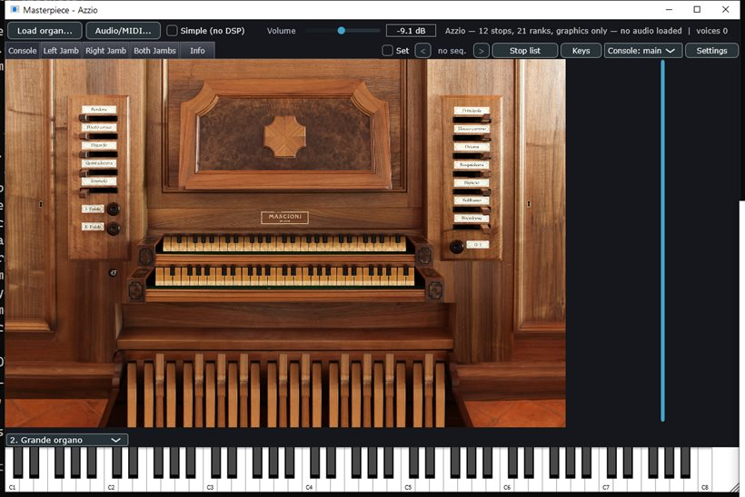 | 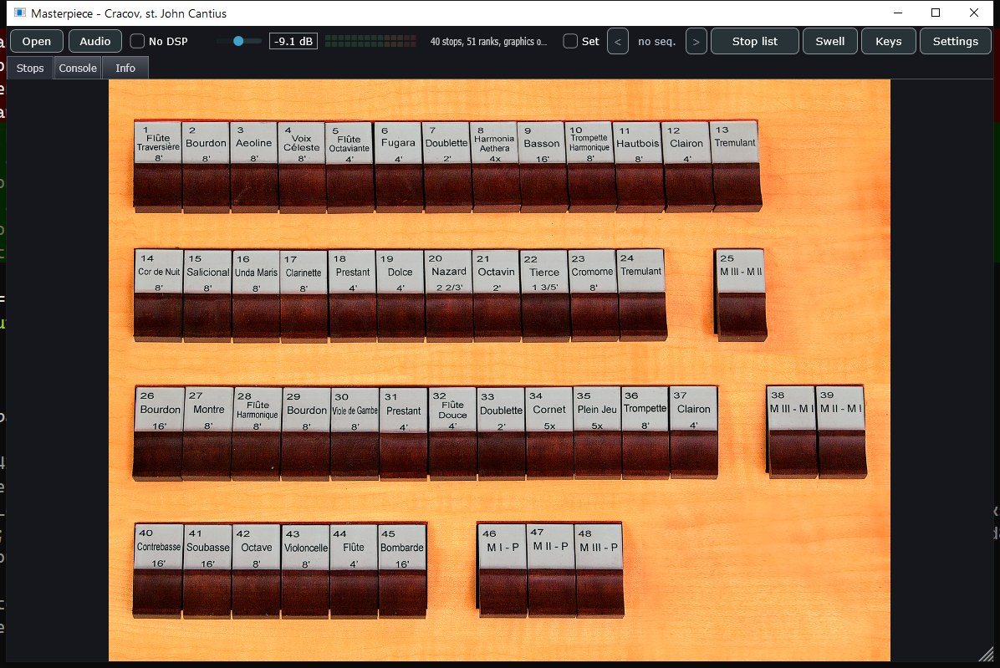 |
| Mascioni, 2016 · 12 stops · [sample set by Piotr Grabowski](https://piotrgrabowski.pl/azzio/) | 40 stops, three manuals · [sample set by Piotr Grabowski](https://piotrgrabowski.pl/cracow-st-john-cantius/) |
| **Długa Kościelna** | **Raszczyce** |
| 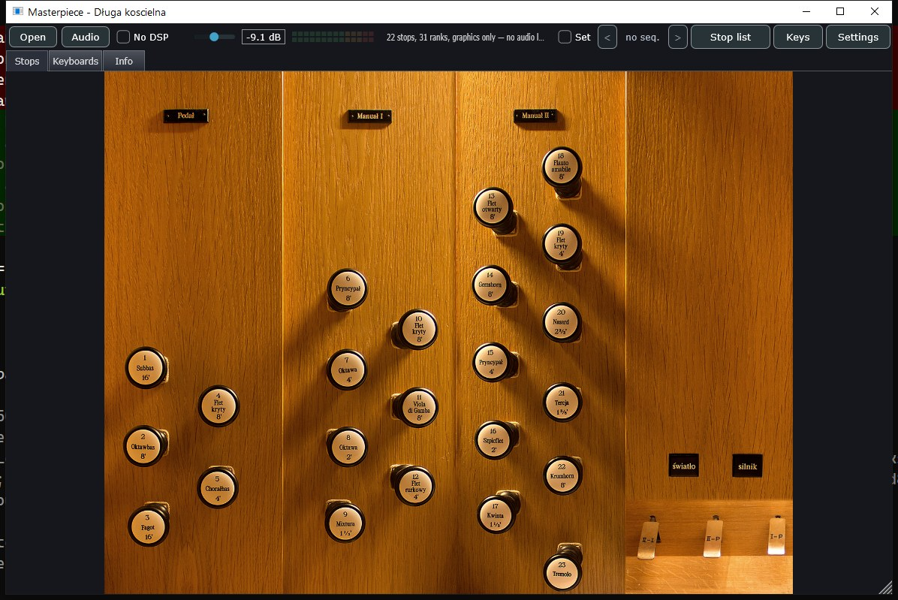 | 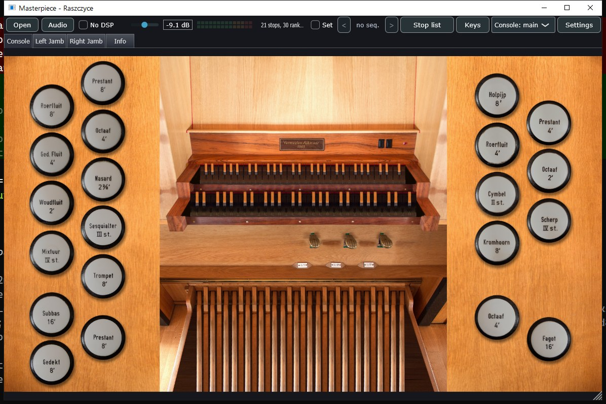 |
| 22 stops · [sample set by Piotr Grabowski](https://piotrgrabowski.pl/dluga-koscielna/) | Vermeulen, 1965 · 21 stops · [sample set by Piotr Grabowski](https://piotrgrabowski.pl/raszczyce/) |
| **Strassburg** | **Friesach** — three manuals, jambs on their own pages |
| 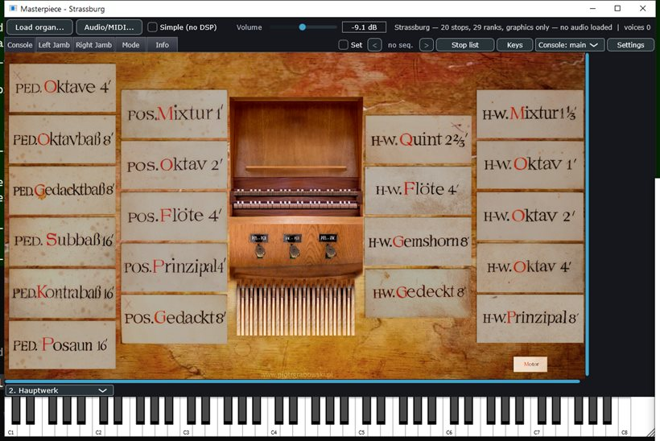 | 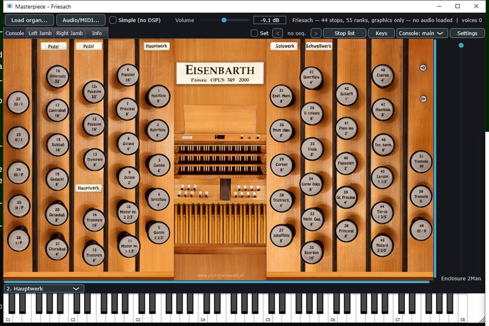 |
| C. Werner, 1743 · 20 stops · [sample set by Piotr Grabowski](https://piotrgrabowski.pl/strassburg/) | Eisenbarth, 2000 · 44 stops · [sample set by Piotr Grabowski](https://piotrgrabowski.pl/friesach/) |
| **Nancy** — four manuals; the keys are part of the photograph, and the drawstops are colour-coded by division | **Lemmer** — a Flentrop under the saints, with the recording perspective on the case |
| 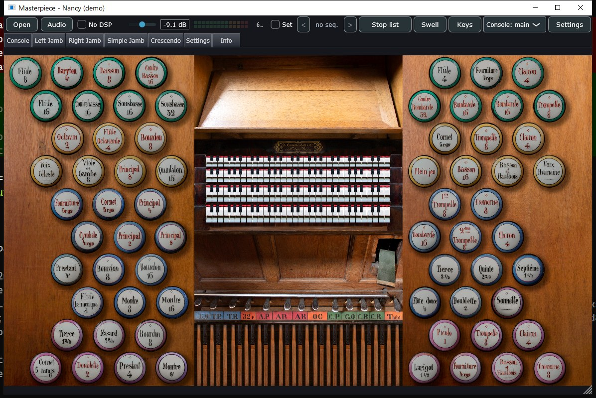 | 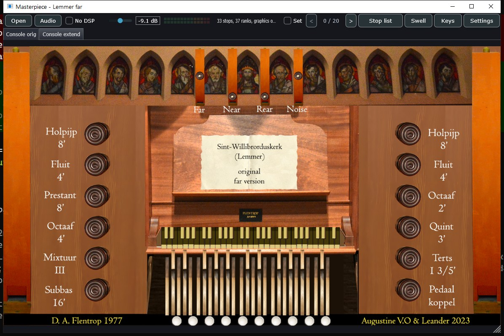 |
| 65 stops, four manuals · [sample set by Piotr Grabowski](https://piotrgrabowski.pl/nancy/) | Flentrop, 1977–78 · 9 registers · [sample set by Augustine's Virtual Organs](https://hauptwerk-augustine.info/Lemmer.php) |

Each organ above is a freely published sample library, separate from this
repository. Nine of the ten are produced by [Piotr
Grabowski](https://piotrgrabowski.pl/); the tenth by [Augustine's Virtual
Organs](https://hauptwerk-augustine.info/). Full credits:
[ATTRIBUTION.md](ATTRIBUTION.md).

Sets that ship several console sizes offer them all; the chooser only appears
when there is a choice to make. Drawn keys and drawstops are clickable, and a
set whose manuals are part of a photographed backdrop falls back to an
on-screen keyboard instead.

---

## Using it

**Loading.** A large library is tens of gigabytes and takes minutes off a slow
disk, so it loads on its own thread: the window stays live, the progress is
real, and the estimate is built from the rate the load actually achieves.
Cancel takes effect at the next file and throws
away what it had read. A cancelled load leaves no partial organ behind.

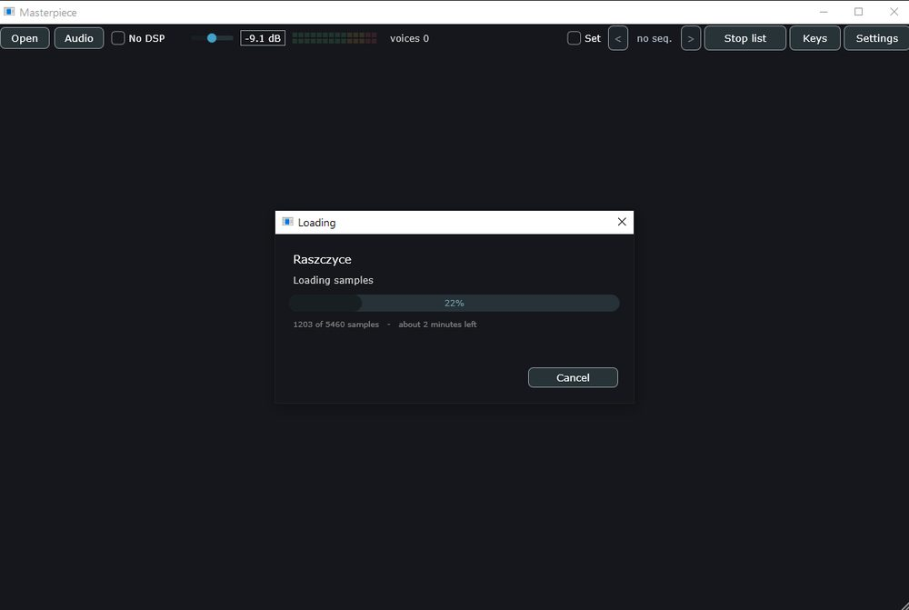

**Playing.** Drawstops, pistons and expression shoes are where the builder put
them. A key pressed with the mouse takes the same path as that note arriving
over MIDI, so anything done from the console works from a real one. The meter
shows what reaches the audio device — after the room, the organ's own level
and the master fader.

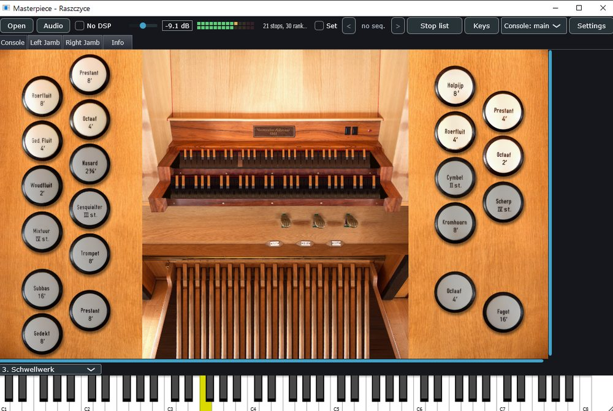

**Registering without artwork.** The stop list covers sets with no console
picture, or stops spread across several jambs: the same registration,
grouped by division.

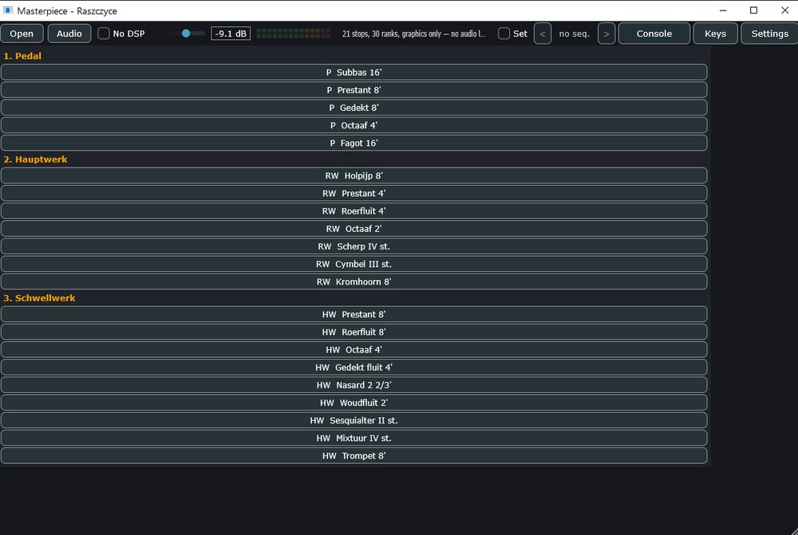

**The engine.** What costs CPU and what costs memory, in one place. *Simple WAV
only* bypasses every refinement at once for a machine that cannot afford them.
Preload and resident format decide how much of a library has to fit in RAM;
streaming holds only the head of each release tail and fetches the rest while
it plays. Disk writes happen only on request — changes apply immediately,
and you choose afterwards whether to forget them, keep them for this organ, or
make them the default for every organ.

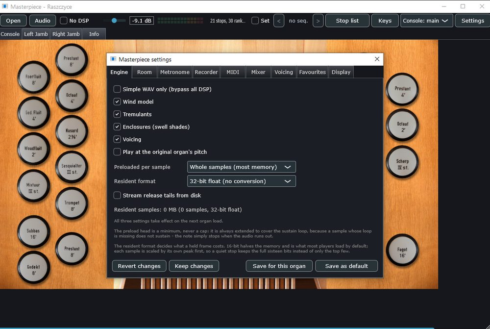

**Routing.** Sample libraries describe no audio routing. Output pairs and
their device channels carry across organs; which rank goes where is saved
per organ, because a rank
number means nothing in a different instrument. An unrouted rank plays
through the first pair, so an organ is audible before you open this page. In
stereo the pairs are summed, so every rank stays audible when you split them up.

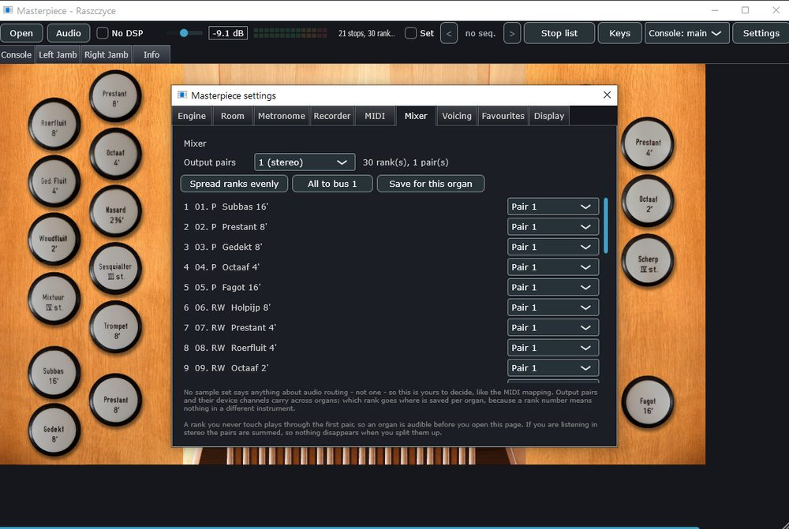

**Voicing.** Rank and per-pipe level and tuning adjustments add, so correcting
one pipe keeps the rank trim.
A and B are two complete sets for direct comparison of a change against
what was there before. Level and tuning are a multiply and a ratio taken
once when a note starts, so they cost nothing while it sounds and work with the
DSP switched off.

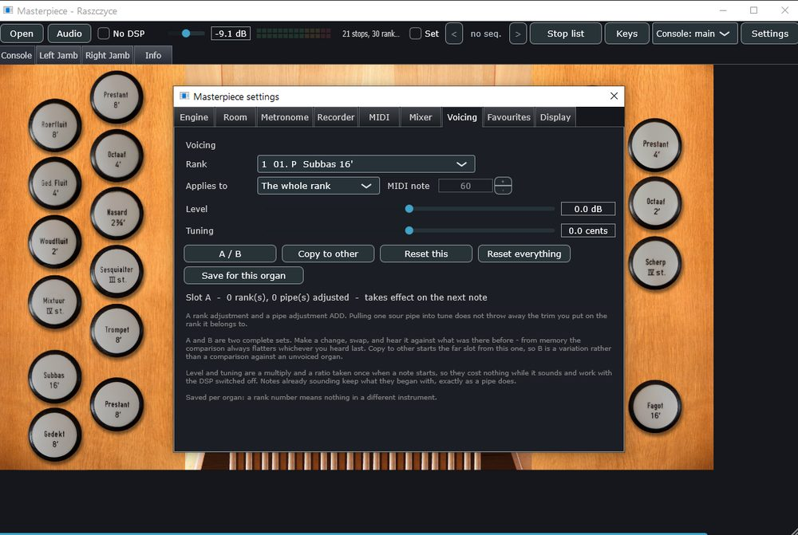

**Getting back to an organ.** Favourites point at numbered slots, which thumb
pistons trigger. Combination sets hold whole registration books —
one for a recital, another for a service — and changing set saves the one you
are leaving first.

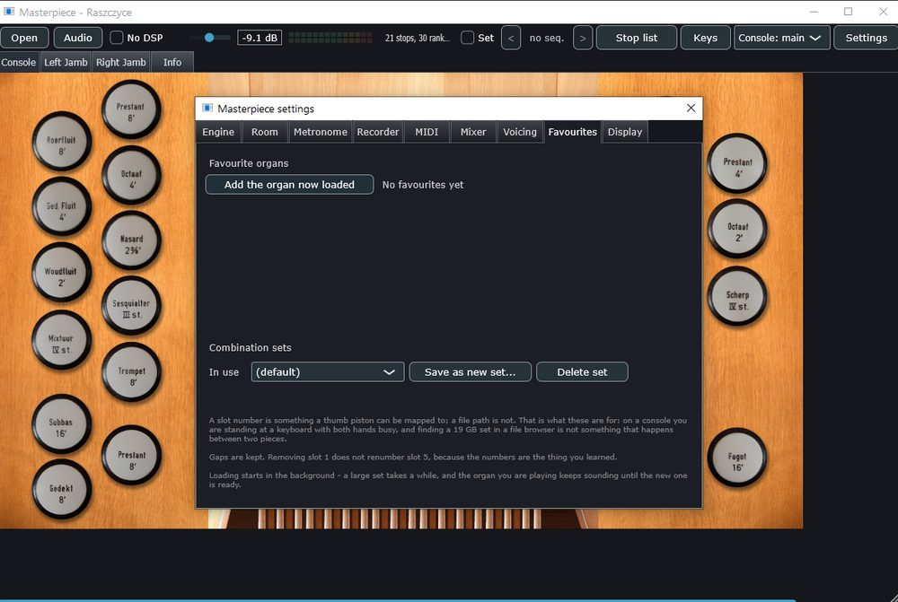

**Your console.** Which manual a key plays is decided by its MIDI channel, and
each console is wired differently. Right-click a drawstop and
move the real one to learn it; the sequencer pistons and the page-turn actions
get their own learn buttons, with nothing on screen to right-click.

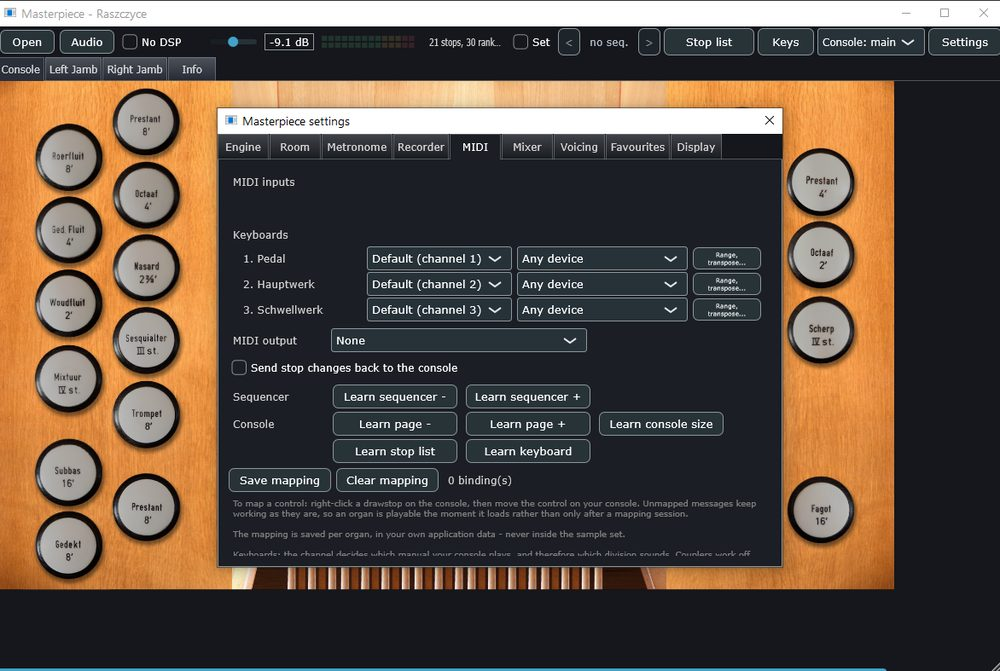

**Jamb displays.** The little text panel on a wired console, driven by system
exclusive. The bytes that introduce the message belong to the display hardware,
so you type them in, and only lines whose text actually changed are sent.

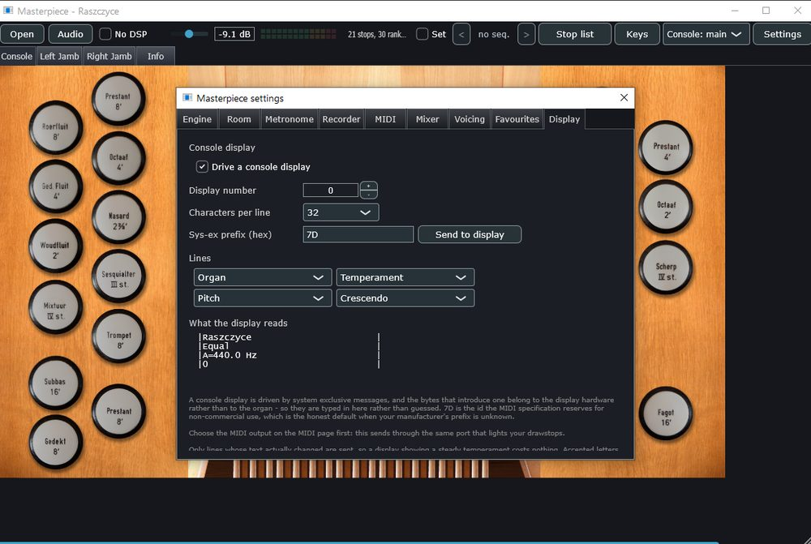

**Practising and recording.** A MIDI recording is the performance and can be
replayed through a different registration; the audio capture is what it sounded
like. Record both at once.

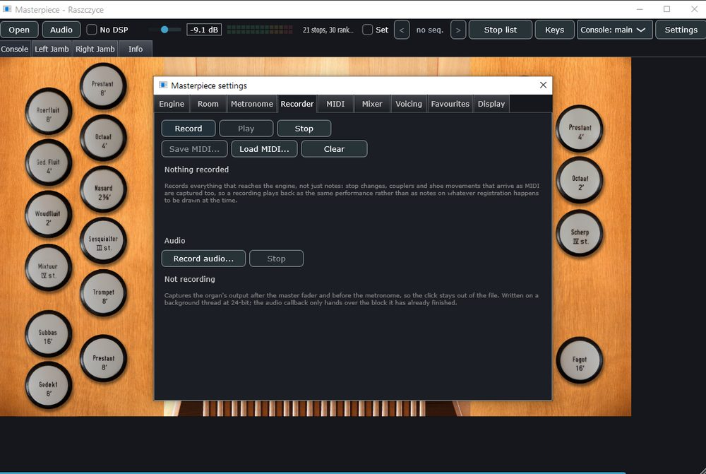

**The room.** Convolution reverb for libraries recorded dry. A library recorded
in its own building already carries that acoustic in the samples; a second
room on top muddies it.

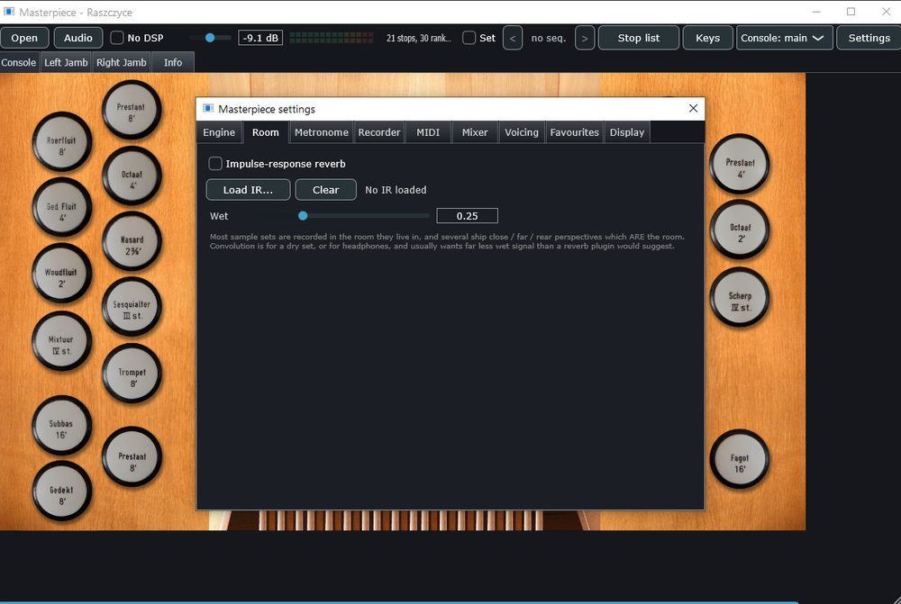

---

## What it does

**The console.** Artwork, drawstops, pistons, expression shoes, text labels and
transparency masks, drawn manuals and pedalboards, multiple display pages, and
alternate layouts. Clicking a key or a drawstop takes exactly the same path as
the equivalent MIDI message.

**In a DAW.** The standalone application and the VST3 and LV2 plugins are the
same engine. As a plugin the organ is one instrument among others: put your
own convolution after it, render a take offline, or give each division its own
track through the multi-channel routing.

**The sound.** Each pipe plays its own recording — attack, sustain loop, and a
matched release tail crossfaded in, so releases keep the room's own decay.
Transposed ranks are resampled with four-point interpolation. When polyphony runs out, the voice that gets stolen
is a decaying release first and the oldest quietest note next. A just-pressed
key is exempt from stealing.

**Tuning.** Equal temperament, or one of seven historical temperaments, each
generated from its own fifth-chain definition. An unrecognised temperament
is reported.

**Expression and tremulants.** Enclosed divisions are filtered per box as the
shoe moves. Tremulants modulate amplitude and pitch per pipe, each chest with
its own depth.

**Wind.** For sets that describe their own pneumatics — compartments, bellows,
valves, and the air each pipe draws — the wind system is solved as a physical
one, and a large registration sags the wind the way the real instrument does.

**Registration.** Couplers work through the instrument's own switch graph.
Thumb pistons and
combinations with capture, a general cancel, a crescendo, and a sequencer that
steps through the generals. Captured registrations are saved beside your own
settings.

**Voicing.** Level and tuning per rank and per individual pipe. The two add,
so correcting one pipe keeps the rank trim. A and B are two complete sets,
for comparing a change against what was there before. Both are a multiply and a ratio taken once when a note starts, so
they cost nothing while it sounds and work with the DSP switched off.

**Memory and streaming.** A large set can be held entirely in RAM, or its
release tails streamed from disk while attacks and loops stay resident — the
same audio either way, sample for sample. A background thread refills
per-voice ring buffers while the note sounds. Samples are held at 24-bit, exact
to the files, or at 16-bit, and a stereo set can be folded to mono: together up
to 9.3x less memory than 32-bit float, measured in [PERFORMANCE.md](PERFORMANCE.md).

**MIDI.** Every input device at once, each knowing which manual it is.
Right-click a drawstop to learn a control. MIDI out lights the drawstops on a
physical console.

**Alongside the organ.** A metronome, impulse-response reverb, and a recorder
that captures stop changes and shoe movements as well as notes.

---

## Performance

Measured on a 44-stop, 17 GB set. Method and full figures:
[PERFORMANCE.md](PERFORMANCE.md).

- **Memory:** up to **9.3x less** than holding every sample as 32-bit float.
  Samples are held at 24-bit, bit-for-bit identical to the files (1.3x
  less), or at 16-bit; a stereo set can be folded to mono as it loads.
  Release tails stream from disk into per-voice ring buffers refilled by a
  background thread, leaving 56% of the sample data on disk. 21.6 GB at
  32-bit float becomes 16.2 GB at 24-bit, 4.65 GB at 16-bit with releases
  streamed, 2.33 GB folded to mono. Sample data can be converted to the
  device's rate as it loads, for libraries recorded at 96 kHz.
- **Loading:** the organ opens up to **3x faster**. Decoded samples are kept
  as one cache file, so the next load of the same organ is one read instead
  of 12,148 decodes: up to **5x faster** sample loading. The cache is keyed
  to the definition and every setting that changes the bytes, so a changed
  setting rebuilds it instead of reading a stale one. One file by default,
  replaced as organs change; one per organ, or off.

---

## Building

Requires a C++20 compiler (MSVC 2022, GCC 12+, or Clang 14+), CMake 3.22+ and
Ninja. JUCE and pugixml are fetched automatically.

```bash
cmake --preset dev
cmake --build --preset dev
```

Presets are also provided for each CI target: `ci-linux`, `ci-macos`,
`ci-windows`, and `ci-linux-arm`, which cross-builds for 32-bit Raspberry Pi.

---

## Running

Launch the app, then **Load organ…** and choose the set's XML definition.

Two flags are useful for skipping a multi-gigabyte load:

```
Masterpiece --odf "<path to the definition>" --gui-only
```

`--gui-only` builds the entire console and reads no audio at all: the organ is
silent and appears in a second or two. `--log <file>` writes the load timings,
if you want to know where the time went.

---

## How it is built

| | |
|---|---|
| Language | C++20 |
| Audio and GUI | JUCE 9 |
| XML | pugixml |
| Build | CMake + Ninja, command line only |
| Platforms | Windows, macOS (Apple silicon and Intel), Linux; Raspberry Pi via cross-build |
| Formats | Standalone, VST3, LV2, AU on macOS |

The engine is split so the parts with no user interface can be tested without
one:

```
mp_core      the XML loader, the validator, the temperament solver
mp_sampler   the voice engine and the streaming backend
mp_control   key flow, couplers, the switch network, pistons, crescendo, wind
mp_dsp       enclosure filters and tremulant modulation
mp_audio     the audio processor, sample storage, routing
mp_ui        the console, the panels, MIDI learn
```

`mp_core`, `mp_sampler` and `mp_control` carry no JUCE at all, which is what
lets the whole musical path be exercised against a synthesised tone instead of
a 40 GB library.

---

## Credits

Masterpiece is its own implementation, but it was written with four
open-source projects open alongside it, and is much the better for them:

- **[GrandOrgue](https://github.com/GrandOrgue/GrandOrgue)** — the shape of the
  voice engine, and the release-crossfade behaviour that stops a key release
  from clicking
- **[OdfEdit](https://github.com/GrandOrgue/OdfEdit)** — the clearest available
  reading of the organ-definition format: which objects exist, how they link,
  and which of them a converter has to give up on
- **[rusty-pipes](https://github.com/dividebysandwich/rusty-pipes)** — sample
  and loop handling, and a great deal of hard-won file-format knowledge
- **[HISE](https://github.com/christophhart/HISE)** — the streaming design:
  per-voice ring buffers refilled off a background thread

The implementation throughout is original; all four stand as references.

Sample libraries and MIDI sequences are credited in
**[ATTRIBUTION.md](ATTRIBUTION.md)**.

---

## Licence

Hauptwerk is a trademark of its owner. Masterpiece is an independent project.

GPL-3.0-only. See [`LICENCE`](LICENCE) and [`COPYING`](COPYING).
