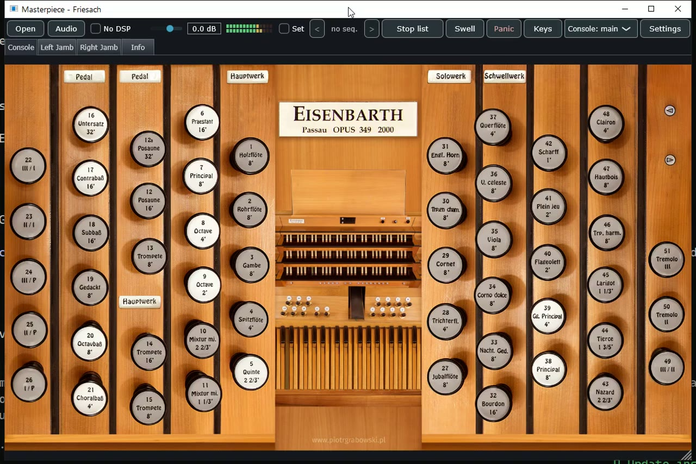

# Masterpiece

### An open-source pipe organ sample player supporting industry-standard sample sets.

It builds the instrument's own console out of the set's definition — artwork,
drawstops, keyboards, pedalboard — and plays it.

[](https://github.com/bonninr/masterpiece/actions/workflows/build.yml)
[](https://github.com/bonninr/masterpiece/releases)
[](https://en.cppreference.com/w/cpp/20)
[](https://juce.com/)
[](https://cmake.org/)
[](#building)
[](#building)
[](LICENCE)


---

## Demonstration recording

Thirty-three works on nine organs, 17 minutes, recorded from the application's
own audio output.

[](https://github.com/bonninr/masterpiece/releases/latest/download/masterpiece-recital.mp4)

**[Watch (MP4, 66 MB)](https://github.com/bonninr/masterpiece/releases/latest/download/masterpiece-recital.mp4)** ·
[Programme and credits](ATTRIBUTION.md#music)

---

## Highlights

- **Standalone and plugin.** One engine, shipped as an application and as
  VST3, AU and LV2 — so the organ can be one instrument among others in a DAW,
  sequenced, rendered offline, or tracked alongside strings and choir.
- **Streaming sampler.** Attacks and loops stay resident; release tails keep
  only their head in RAM and stream the rest into per-voice ring buffers while
  the note sounds. One set drops from 12.2 GB to 5.6 GB, sample-identical.
- **Wind model.** Compartments, bellows, valves and the air each pipe draws,
  solved as a physical system: a full registration sags the wind, and tuning
  and attack move with it.
- **Voicing per pipe.** Level and tuning per rank *and* per pipe, adding rather
  than replacing, with A/B sets for comparison — and free at playing time,
  because both are applied once when a note starts.
- **Couplers as a switch network.** A key reaching a pipe is a walk through the
  instrument's own switch graph, so couplers, octaves and unison-off compose
  the way the builder wired them.
- **Eight historical temperaments**, each generated from its fifth-chain
  definition rather than transcribed.
- **The real console**, drawn from the set's own definition — and a stop list
  for libraries that ship no artwork.

---

## What it is

Sampled pipe organs are distributed as large libraries: a recording of every
pipe, plus an XML definition describing the instrument around them — how the
console is drawn, which key reaches which pipe, what the couplers do, how the
wind system is built. Masterpiece reads those libraries and turns them back
into a playable instrument.

It is a fresh design rather than a fork. The console is the real one: the
artwork, the drawstop positions, the keyboards and the pedalboard all come out
of the set's own definition, so an organ looks and behaves like itself rather
than a generic mixer with the stop names changed.

It runs as a standalone application and as a VST3, AU or LV2 plugin — the same
engine either way.

---

## The console

The same program, reading different libraries.

| | |
|:--:|:--:|
| **Lipiny** — a historic case, drawstops lettered in Fraktur | **Melcer Chamber Music Hall** |
|  |  |
| A. Volkmann, 1898 · 25 stops · [sample set by Piotr Grabowski](https://piotrgrabowski.pl/lipiny/) | chamber organ · [sample set by Piotr Grabowski](https://piotrgrabowski.pl/melcer-chamber-music-hall/) |
| **Azzio** | **Kraków, St. John Cantius** |
|  |  |
| Mascioni, 2016 · 12 stops · [sample set by Piotr Grabowski](https://piotrgrabowski.pl/azzio/) | 40 stops, three manuals · [sample set by Piotr Grabowski](https://piotrgrabowski.pl/cracow-st-john-cantius/) |
| **Długa Kościelna** | **Raszczyce** |
|  |  |
| 22 stops · [sample set by Piotr Grabowski](https://piotrgrabowski.pl/dluga-koscielna/) | Vermeulen, 1965 · 21 stops · [sample set by Piotr Grabowski](https://piotrgrabowski.pl/raszczyce/) |
| **Strassburg** | **Friesach** — three manuals, jambs on their own pages |
|  |  |
| C. Werner, 1743 · 20 stops · [sample set by Piotr Grabowski](https://piotrgrabowski.pl/strassburg/) | Eisenbarth, 2000 · 44 stops · [sample set by Piotr Grabowski](https://piotrgrabowski.pl/friesach/) |
| **Nancy** — four manuals; the keys are part of the photograph, and the drawstops are colour-coded by division | **Lemmer** — a Flentrop under the saints, with the recording perspective on the case |
|  |  |
| 65 stops, four manuals · [sample set by Piotr Grabowski](https://piotrgrabowski.pl/nancy/) | Flentrop, 1977–78 · 9 registers · [sample set by Augustine's Virtual Organs](https://hauptwerk-augustine.info/Lemmer.php) |

Each organ above is a freely published sample library and is not part of this
repository. Nine of the ten are produced by [Piotr
Grabowski](https://piotrgrabowski.pl/); the tenth by [Augustine's Virtual
Organs](https://hauptwerk-augustine.info/). Full credits:
[ATTRIBUTION.md](ATTRIBUTION.md).

Sets that ship several console sizes offer them all; the chooser only appears
when there is a choice to make. Drawn keys and drawstops are clickable, and a
set whose manuals are part of a photographed backdrop falls back to an
on-screen keyboard instead.

---

## Using it

**Loading.** A large library is tens of gigabytes and takes minutes off a slow
disk, so it loads on its own thread: the window stays live, the progress is
real, and the estimate is built from the rate the load is actually achieving
rather than from a file count. Cancel takes effect at the next file and throws
away what it had read — a half-loaded organ that plays some notes and silently
drops others would send you hunting through your sample set.


**Playing.** Drawstops, pistons and expression shoes are where the builder put
them. A key pressed with the mouse takes the same path as the same note
arriving over MIDI, so anything you can do from the console you can do from a
real one. The meter shows what reaches the audio device — after the room, the
organ's own level and the master fader.


**Registering without artwork.** Some libraries ship no console picture, and
some ship sixty stops across two jambs you would rather not hunt through. The
stop list is the same registration by another route, grouped by division.


**The engine.** What costs CPU and what costs memory, in one place. *Simple WAV
only* bypasses every refinement at once for a machine that cannot afford them.
Preload and resident format decide how much of a library has to fit in RAM;
streaming holds only the head of each release tail and fetches the rest while
it plays. Nothing here writes to disk on its own — changes apply immediately,
and you choose afterwards whether to forget them, keep them for this organ, or
make them the default for every organ.


**Routing.** No sample library says anything about audio routing, so this is
yours to decide — like the MIDI mapping. Output pairs and their device channels
carry across organs; which rank goes where is saved per organ, because a rank
number means nothing in a different instrument. A rank you never touch plays
through the first pair, so an organ is audible before you open this page, and
in stereo the pairs are summed so nothing disappears when you split them up.


**Voicing.** A rank adjustment and a single-pipe adjustment add, so pulling one
sour pipe into tune does not throw away the trim you put on the rank it belongs
to. A and B are two complete sets: make a change, swap, and hear it against
what was there before, because from memory the comparison always flatters
whichever you heard last. Level and tuning are a multiply and a ratio taken
once when a note starts, so they cost nothing while it sounds and work with the
DSP switched off.


**Getting back to an organ.** A slot number is something a thumb piston can be
mapped to; a file path is not. Combination sets are whole registration books —
one for a recital, another for a service — and changing set saves the one you
are leaving first.


**Your console.** Which manual a key plays is decided by its MIDI channel, and
no organ file can guess how your console is wired. Right-click a drawstop and
move the real one to learn it; the sequencer pistons and the page-turn actions
get their own learn buttons, because the organ does not declare them and there
is nothing on screen to right-click.


**Jamb displays.** The little text panel on a wired console, driven by system
exclusive. The bytes that introduce the message belong to the display hardware
rather than to the organ, so they are typed in rather than guessed, and only
lines whose text actually changed are sent.


**Practising and recording.** A MIDI recording is the performance and can be
replayed through a different registration; the audio capture is what it sounded
like. Both at once is the useful combination.


**The room.** Convolution reverb for libraries recorded dry. A library recorded
in its own building already carries that acoustic in the samples, and a second
room on top of it mostly muddies — this earns its keep on a dry set.


---

## What it does

**The console.** Artwork, drawstops, pistons, expression shoes, text labels and
transparency masks, drawn manuals and pedalboards, multiple display pages, and
alternate layouts. Clicking a key or a drawstop takes exactly the same path as
the equivalent MIDI message.

**In a DAW.** The standalone application and the VST3, AU and LV2 plugins are
the same engine. As a plugin the organ is one instrument among others: put your
own convolution after it, render a take offline, or give each division its own
track through the multi-channel routing.

**The sound.** Each pipe plays its own recording — attack, sustain loop, and a
matched release tail crossfaded in rather than cut to, so releasing a key
leaves the room's own decay behind. Transposed ranks are resampled with
four-point interpolation. When polyphony runs out, the voice that gets stolen
is a decaying release first and the oldest quietest note next; a note you have
just pressed is never taken.

**Tuning.** Equal temperament, or one of eight historical temperaments, each
generated from its own fifth-chain definition rather than transcribed. A set
naming a temperament nobody recognises is reported, never quietly played in
equal.

**Expression and tremulants.** Enclosed divisions are filtered per box as the
shoe moves. Tremulants modulate amplitude and pitch per pipe, so one chest can
wobble while another does not.

**Wind.** For sets that describe their own pneumatics — compartments, bellows,
valves, and the air each pipe draws — the wind system is solved as a physical
one, and a large registration sags the wind the way the real instrument does.

**Registration.** Couplers, because a key reaching a pipe is a walk through the
instrument's own switch graph rather than a checkbox. Thumb pistons and
combinations with capture, a general cancel, a crescendo, and a sequencer that
steps through the generals. Captured registrations are saved beside your own
settings, never written back into the sample library.

**Voicing.** Level and tuning per rank and per individual pipe. The two add
rather than replace, so pulling one sour pipe into tune keeps the trim on its
rank. A and B are two complete sets, for comparing a change against what was
there before. Both are a multiply and a ratio taken once when a note starts, so
they cost nothing while it sounds and work with the DSP switched off.

**Memory and streaming.** A large set can be held entirely in RAM, or its
release tails streamed from disk while attacks and loops stay resident — the
same audio either way, sample for sample, and 12.2 GB down to 5.6 GB on one
set. A background thread refills per-voice ring buffers while the note sounds.
Samples can also be kept at reduced precision, which roughly halves the
footprint for a set that would not otherwise fit.

**MIDI.** Every input device at once, each knowing which manual it is.
Right-click a drawstop to learn a control. MIDI out lights the drawstops on a
physical console.

**Alongside the organ.** A metronome, impulse-response reverb, and a recorder
that captures stop changes and shoe movements as well as notes.

---

## Building

Requires a C++20 compiler (MSVC 2022, GCC 12+, or Clang 14+), CMake 3.22+ and
Ninja. JUCE and pugixml are fetched automatically.

```bash
cmake --preset dev
cmake --build --preset dev
```

Presets are also provided for each CI target: `ci-linux`, `ci-macos`,
`ci-windows`, and `ci-linux-arm`, which cross-builds for 32-bit Raspberry Pi.

---

## Running

Launch the app, then **Load organ…** and choose the set's XML definition.

Two flags are useful when you do not want to wait on a multi-gigabyte load:

```
Masterpiece --odf "<path to the definition>" --gui-only
```

`--gui-only` builds the entire console and reads no audio at all: the organ is
silent and appears in a second or two. `--log <file>` writes the load timings,
if you want to know where the time went.

---

## How it is built

| | |
|---|---|
| Language | C++20 |
| Audio and GUI | JUCE 9 |
| XML | pugixml |
| Build | CMake + Ninja, command line only |
| Platforms | Windows, macOS, Linux; Raspberry Pi via cross-build |
| Formats | Standalone, VST3, AU, LV2 |

The engine is split so the parts with no user interface can be tested without
one:

```
mp_core      the XML loader, the validator, the temperament solver
mp_sampler   the voice engine and the streaming backend
mp_control   key flow, couplers, the switch network, pistons, crescendo, wind
mp_dsp       enclosure filters and tremulant modulation
mp_audio     the audio processor, sample storage, routing
mp_ui        the console, the panels, MIDI learn
```

`mp_core`, `mp_sampler` and `mp_control` carry no JUCE at all, which is what
lets the whole musical path be exercised against a synthesised tone instead of
a 40 GB library.

---

## Credits

Masterpiece is its own implementation, but it was written with four
open-source projects open alongside it, and is much the better for them:

- **[GrandOrgue](https://github.com/GrandOrgue/GrandOrgue)** — the shape of the
  voice engine, and the release-crossfade behaviour that stops a key release
  from clicking
- **[OdfEdit](https://github.com/GrandOrgue/OdfEdit)** — the clearest available
  reading of the organ-definition format: which objects exist, how they link,
  and which of them a converter has to give up on
- **[rusty-pipes](https://github.com/dividebysandwich/rusty-pipes)** — sample
  and loop handling, and a great deal of hard-won file-format knowledge
- **[HISE](https://github.com/christophhart/HISE)** — the streaming design:
  per-voice ring buffers refilled off a background thread

None of their code is compiled in.

Sample libraries and MIDI sequences are credited in
**[ATTRIBUTION.md](ATTRIBUTION.md)**.

---

## Licence

GPL-3.0-only. See [`LICENCE`](LICENCE) and [`COPYING`](COPYING).
